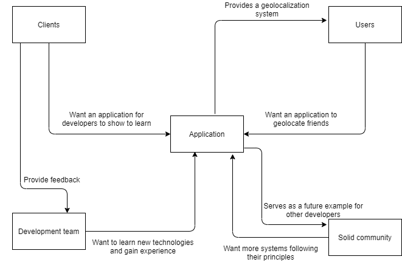

[[section-introduction-and-goals]]
== Introduction and Goals
This porject is about a mobile app, which acts like a radar. Any user can share his location to his friends and see where they are at real time.
The system can be accessed on android and iOS phones as well as in desktop environments.

=== Requirements Overview

* Functional requirements

** The user will be able to see a list of his friends
** The user will be able to see in a map where are his friends
** The user has the hability of change the distance where the firends are
** The system will notify the user if a friend is near
** The admin will be able administrate all the users of the app
** The admin will be able to delete the users

* Non functional requirements

** The project will follow the SOLID principles
** The information of the users will be stored on SOLID PODS but the location of them
** The location of the users will be stored on a Mongo database
** The location is taken from the device from where the user connects
** The system is deploy on the cloud using the Heroku's environment

=== Quality Goals

[options="header"]
|===
|Quality goal|Motivation
| _Understandability_ | _Any user should be able to easily understand and comprehend the functionality and ussage_ 
| _Attractiveness_ | _The user interface should be attractive to pottential ussers_ 
| _Security_ | _The data of any usser should be properly protected_ 
| _Testability_ | _The application should be able to go through different test_ 
|===

=== Stakeholders

[options="header"]
|===
|Role/Name|Expectations
| _Clients_ | _Those who asked for the development of the project. They expect a fully functional application allowing for the usage of the radar._
| _Development team_ | _Those in charge of developing the application, expecting to learn about new technologies._
| _Users_ | _Those who will use the application. They will expect a simple to understand interface and a system capable of protecting their personal data efectibly._
| _Solid community_ | _Community that wants developers to produce as many applications following their principles as possible, in order to progress and improve their project._
|===
