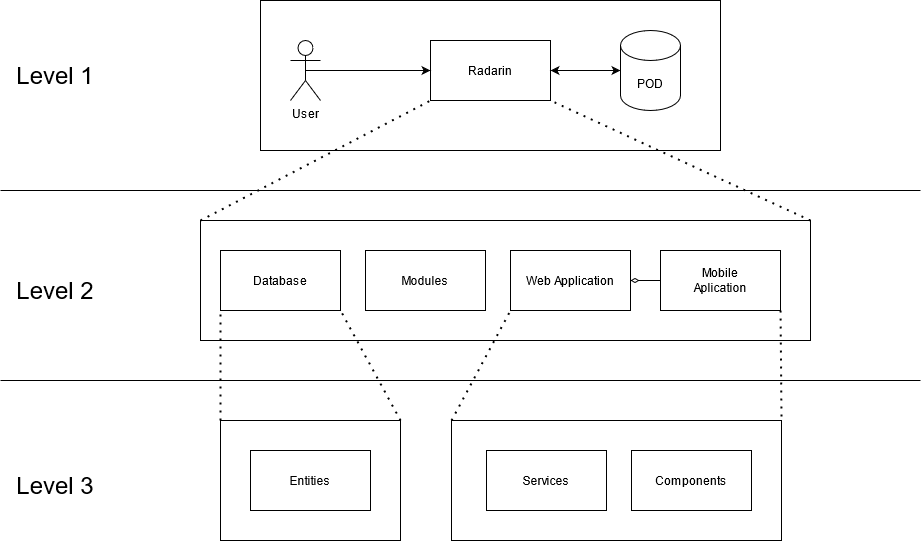

[[section-building-block-view]]

== Building Block View

This diagram represents the main abstract structure of the application.

=== Whitebox Overall System  (Level 1)

===== Motivation

This shows a basic structure of the system application. The locations uf the users are stored on their own PODs, only the essential information is stored on the application, that will be persistent. 

===== Contained Building Blocks
|=========================================================
| **Name** | **Responsibility**

| Radarin
| The Application that the user interacts with. This represents the whole estructure of the main product.

| POD
| Data stored securely with the purpouse of creating a value to the user. This is needed to implement the Solid principles. 

|=========================================================

=== Level 2

===== Motivation
 
This level represents the basic view of the application, in other words, the esential components of the application.

===== Contained Building Blocks

[cols="1,2" options="header"]
|===
| **Name** | **Responsibility**
| Web Application | This is the representation of the application on the web.
| Mobile Aplication |  This is the representation of the application on the mopbile phone.
| Database | This is the representation of the application on the web.
| Modules | Stands for the npm modules installed in the project and our dependencies to them.
|===

=== Level 3

==== App

===== Motivation

Representation of the main blocks of the application for structuring the diferent parts of it. All of them are used in diferent objectives, every one of them will specialize in one part of the core application.

===== Contained Building Blocks

[cols="1,2" options="header"]
|===
| **Name** | **Responsibility**
| Components | This will communicate the user with the application, providing the interface alongside some functionality.
| Services | This will provide the main logic of the aplication.
| Entities | This will be the classes generated to give persistency to the application, managed by the database.
|===

